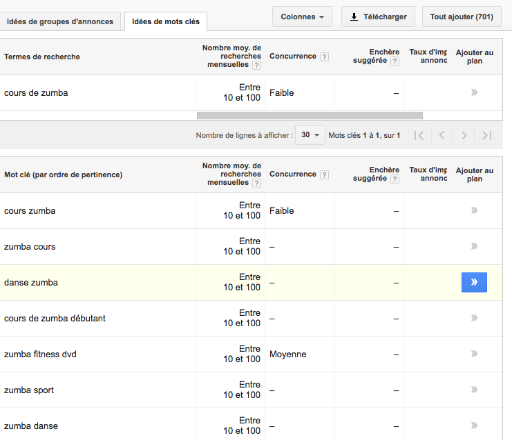
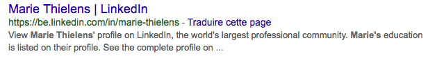

# Référencement

## Référencement :

Les moteurs de recherche référencent les pages (chaque page individuellement) d’un site internet et non le site.

Comment ça marche ?

1. Le Crawling : le moteur envoie des petits robots qui vont se balader de page en page. Tant que le robot n’est pas passé sur notre page il ne nous connait pas.
2. Analyse de la page : titre de la page. Nom de domaine. Noms de fichiers. Légendes des images. Textes
3. Indexation : la position de la page dépend de la pertinence et de la notoriété.
4. Traitement des requêtes

## Evaluer la pertinence d’une page

_Mot-clé_ dans la page au bon endroit, au bon format. Un mot clé c’est la question qu’on pose à google.
_Contenu de la page_ : retrouve t on le mot clé dans le contenu de la page ?
_Comportement des visiteurs_ : le taux de rebond (quand après avoir visité notre site l’utilisateur refait la même requête, recherche dans google. Ca nous dévalue).

## La notoriété d’une page

Les pages dont les gens parlent, font des liens vers nous (backlinks). 

_Outils_ : Google Search Console. : https://www.google.com/webmasters/tools/home?hl=fr

wordpress :

1. Changer les permaliens (l’url de vos articles). Réglages->Permaliens : Nom de l’article.
2. Quelques réglages généraux : Réglages->Général : Enregistrer le titre de votre site et le slogan
3. Dans le menu Réglages > Lecture, vérifiez que la case de visibilité pour les moteurs de recherche est bien décochée. 
4. Choisir le mot clé parfait : Le mot-clé focus est le terme de recherche pour lequel vous souhaitez le plus que votre page soit classée. Par conséquent, lorsque les internautes recherchent ce mot-clé ou cette expression, ils doivent vous trouver.

Il y a une page qui est de  loin la plus importante en termes de notre et votre image de marque: la page d'accueil. Votre page d'accueil a une tâche, et une seule tâche d'un point de vue SEO: à classer pour votre marque. Je ne peux penser à aucun site Web significatif où cela devrait être différent.

## Stratégie de mots clés

Les principales questions que vous devriez vous poser sont simples:

- Qu'est-ce que les gens recherchent quand ils devraient me trouver ?
- À quelle question mon produit ou service répond-il, quel problème résout-il ?

Pour nous, la recherche par mot-clé comporte trois étapes. D'abord, vous écrivez la mission de votre entreprise. Ensuite, vous faites une liste de tous les mots-clés que vous voulez trouver. (Qu'est-ce que ces gens vont chercher?) Enfin, vous créez des pages de destination pour chacun de ces mots clés.

! Un mot clé principal par page

## Lister ses mots-clés (idée de mot clé)

Idées de mots clés : (environ 4 mots)

- Faire une liste soi même (Produits, Services, Société, Dirigeants, Notion géographique, Métiers). Prendre dictionnaire de synonyme et vous complétez la liste. 60 mots au moins. Vous êtes la bonne réponse à quelle question ?
- Analyser les mots-clé que recherchent les internautes : quel genre de recherche font-ils ? Il faut s’adapter à sa cible !  L’ outil : Google AdWords 
    1. Connaitre le volume de recherche 
    2. Trouver d’autres mots-clés. 
Attention cliquez sur passer le guide de configuration pour ne pas devoir payer

L’onglet Outils->outils  de planification des mots clés. Entrer un mot clé, par exemple cours de zumba. On voit qu’il est cherché entre 10 et 100 fois par mois. L’idée est donc de lister de nouveaux mots-clés grâce à cet outil, en indiquant à chaque fois le volume de recherche mensuel moyen correspondant.

Les mots-clés de ses concurrents : l’outil https://fr.semrush.com/. La version gratuite est limitée à deux ou 3 recherches par jour. Il faut rentrer le site de son concurrent. Ca peut donner des idées de mots clés.

## La pertinance

Le fait que votre page convienne mieux que les autres. (un bon mot clé par page, référencement naturel). SEO -> Search Engine Optimization (l'optimisation du site pour les moteurs de recherche).

## Le contenant

Imaginez que google est un libraire. Qui a pleins de livres. Si je demande un livre (un mot clé) sur les princesses pour enfant de 3 ans et demi.

Formats de présentation :

- titre
- nom de domaine, adresse
- Métadescription : la description du site. Comme une 4ème de couverture pour un livre.

Pour optimiser notre référencement on va travailler sur :

### L'architecture du site et de la page

- Vérifiez votre page avec https://validator.w3.org/

### La présence des mots-clés sur la page

A quels endroits ?

- Nom de domaine, adresse de la page : https://www.thielens-marie.be/
- Titre de la page : doit contenir votre mot clé principal : marie thielens
- Titre des paragraphes . Mettre des balises h. Le titre principal est h1. Les autres mots clé peuvent être sur du h2 etc..
- Description des images : avec alt. Pour que google sache de quoi parle cette image
- Dans le texte dans le contenu de votre page. Mettre les mots clés

## Le contenu

le texte de votre page.

- En rapport avec le sujet :

    - Utilisez vos mots-clés et le champ lexical associé
    - Ecrivez du contenu pertinent et creatif
    - Adaptez la page à votre cible
    - Adaptez la page au support (responsive).

## La notoriété

On acquiert de la notoriété grâce :

- Aux liens entrant : les backcliks. Un lien vers votre page. Plus les gens font des liens vers votre page plus vous êtes connu. Le mieux est que ces liens viennent de site qui ont eux-même une grosse notoriété.

### Comment obtenir un lien ?

- En rechercher soi-même
    - Sur des annuaires de site
    - SpamCo : commenter et mettre un lien sur un site.
    - Des forums sur notre univers.
- Echanger des liens
    - Ecrire un article sur un blog avec notre site en lien
- Sur les résaux sociaux